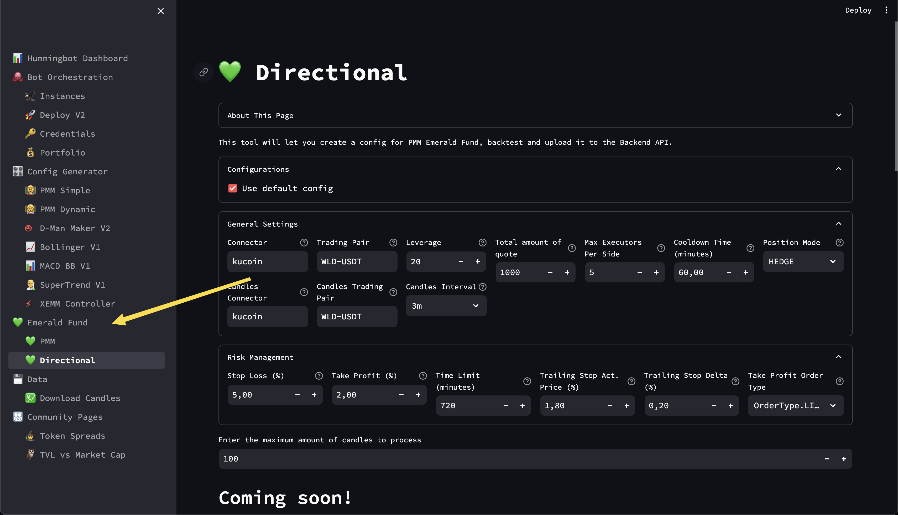
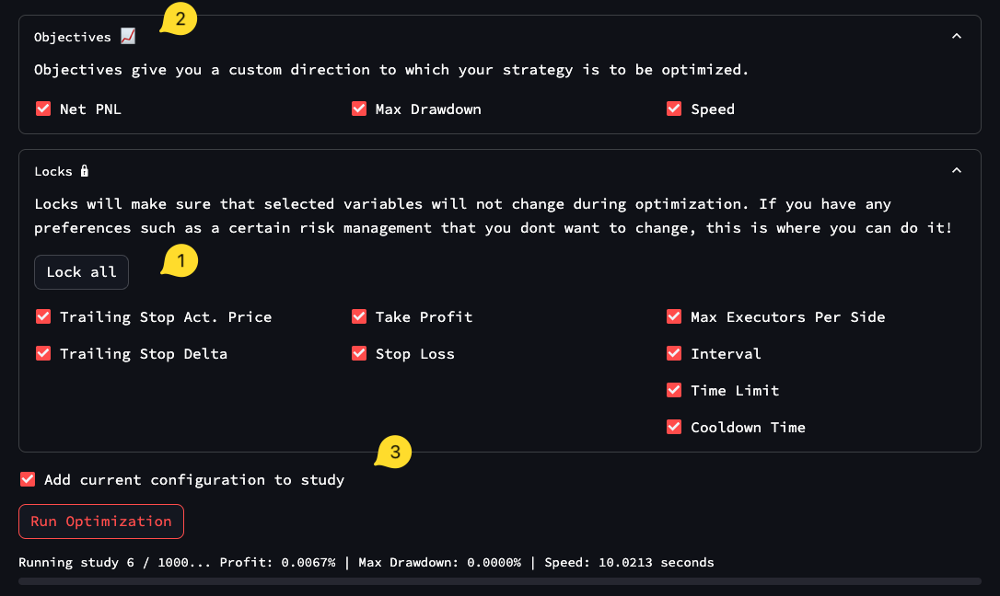

# "There's magic in giving"

The official Emerald Fund Dashboard plugin is a result of years of Hummingbot usage. With it's own Strategy format, you can create, backtest, and optimize in 1 place, without ever having to leave the Hummingbot Dashboard!

The goal is to be user-friendly while offering all the features that Hummingbot V2 has, in a beginner-friendly package.

# Tutorial + Demo

Here's everything you need to know: https://youtu.be/5jaC5fbqK6M

# Features

- Easy to install on top of the official Hummingbot Deploy
- Completely made up-to-date with V2 strategies, backend API and the Dashboard
- Custom V2 strategy format: Create, backtest, optimize in 1 place
- Automatic support for Optuna optimization (no need to code this yourself)
- Multi strategy: Both directional and perpetual market making is supported!
- Extremely powerful Optuna optimizer framework: Test your strategies against multiple market conditions, improved performance and better overview of your strategy's strong and weak spots.

# How to install

- To avoid conflicts, make sure that any previous installation of Hummingbot Deploy is shut down if you have one.
  - For more advanced users, it is possible to add the Emerald fund to their own Deploy installation by following what changes have been made in our repo.
- Follow the instructions in the patched Hummingbot Deploy: https://github.com/peterwilli/hummingbot-deploy/tree/emerald-fund
- Once the dashboard is live, the emerald fund should be on the left side of your dashboard!
  
- You can play with some [examples from here](example_strategies/). When pasting examples, make sure to hit ctrl+enter (cmd+enter on Mac) to load the new code!
- Last but not least - Have fun! And if you make money, remember, think of how many people you can help with your gains, rather than how many sports cars you can buy. Trust me, its much more fulfilling!

# How to update

Just run `git pull` followed by `docker compose restart` on the deploy folder!

# Changelog 🏗

## 2024-09-30

1. Lock variables during optimization! If you have risk preferences you wish not to change, you can lock those here.
2. Multi-objective: You can now customize where to optimize your strategy for, with speed being a third objective you can now use!
3. Add current config to study: Lets say you wish to use your optimized strategy on a new trading pair. With this feature, you can push the config to the same pipeline as the rest of the trials. This way, you may have a headstart if you do this with a highly optimized strategy but with some small changes, such as a different trading pair.

## 2024-09-29

1. Huge speed boost, nearly 10x faster on optimization with sections!

# Coming soon 👀

- Full-AI assistant: Assist in creation, optimization, and backtesting, as well as correct mistakes and propose updated strategies based on findings during backtesting
    - Training EmeraldFundLlama is expensive! All the data and models are in-house made with a custom dataset and training happens on my own budget, a lot of manual labour to automate the rest. [Please consider subscribing to my patreon and you will get early access to the models](https://www.patreon.com/emerald_show).

# Support / contribute

- Feel free to [join my Discord server](https://discord.gg/dCjH8zZXuM), we can chat!
- I'm open for feedback and contributions, feel free to join in!
- Financial contributions are welcome on my patreon, you'll get exclusive access to early content + a special role on my server 💚

# Thanks

- dardonacci and fengtality for showing me the Dashboard and giving me a crash course
- dardonacci for answering all my questions I had during the development. It would otherwise not have been possible

# Sister projects

- [Hummingbot Discord Bot](https://github.com/peterwilli/HummingDiscordBot)
